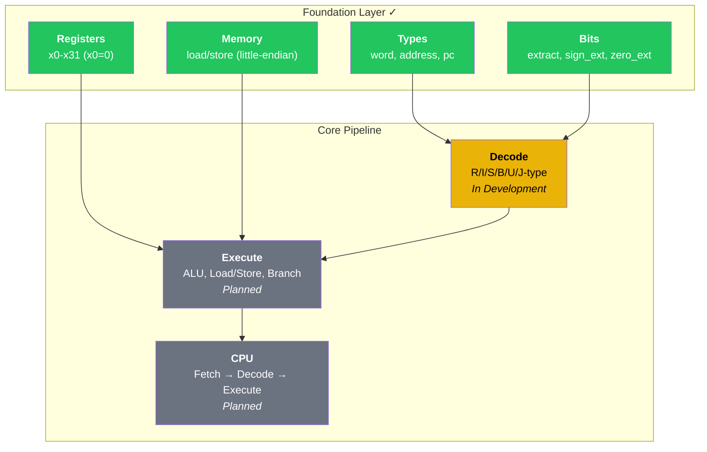

# rv32emu

A RISC-V RV32I emulator implemented from scratch in OCaml.

[]()
[]()
[]()

## Overview

**rv32emu** is a cycle-accurate emulator for the RISC-V RV32I base integer instruction set, built entirely from the ground up in OCaml. This project demonstrates deep understanding of CPU architecture, instruction encoding, and low-level systems programming through a functional programming lens.

### Why OCaml?

OCaml's type system and pattern matching make it exceptionally well-suited for instruction set emulation:

- **Algebraic Data Types** elegantly represent the instruction set taxonomy
- **Exhaustive Pattern Matching** ensures all instruction variants are handled
- **Strong Static Typing** catches encoding errors at compile time
- **Immutable-First Design** makes CPU state transitions explicit and testable

## Current Status

### Implemented

- **Type System** — Foundational types for words, addresses, and register indices
- **Bit Manipulation** — Utilities for instruction field extraction and sign/zero extension
- **Register File** — 32 general-purpose registers with x0 hardwired to zero
- **Memory Subsystem** — Byte-addressable little-endian memory with load/store operations
- **Test Suite** — 42 unit tests covering all foundation components

### In Development

- Instruction decoder (R/I/S/B/U/J-type formats)
- Instruction execution engine
- CPU fetch-decode-execute cycle

### Planned

- ELF binary loading
- System call emulation
- Instruction tracing and debugging
- RISC-V compliance testing

## Architecture



## Project Structure

```
rv32emu/
├── lib/                    # Core library
│   ├── types.ml           # Fundamental type definitions
│   ├── bits.ml            # Bit manipulation utilities
│   ├── registers.ml       # 32-register file (x0 hardwired to zero)
│   └── memory.ml          # Byte-addressable memory subsystem
├── bin/                    # CLI executable
│   └── main.ml            # Command-line interface
├── test/                   # Test suite (42 tests)
│   ├── test_bits.ml       # Bit manipulation tests
│   ├── test_registers.ml  # Register file tests
│   └── test_memory.ml     # Memory subsystem tests
└── programs/               # Sample RISC-V programs
```

## Building

### Prerequisites

- OCaml >= 5.4.0
- Dune >= 3.20.0
- RISC-V GNU Toolchain (optional, for compiling test programs)

### Build & Test

```bash
# Build the project
dune build

# Run all tests
dune runtest

# Run the emulator
dune exec rv32emu
```

## Target: RV32I Instruction Set

The emulator targets all 47 instructions from the RISC-V RV32I base specification:

| Category | Instructions |
|----------|-------------|
| **Arithmetic** | ADD, SUB, ADDI, LUI, AUIPC |
| **Logical** | AND, OR, XOR, ANDI, ORI, XORI |
| **Shifts** | SLL, SRL, SRA, SLLI, SRLI, SRAI |
| **Compare** | SLT, SLTU, SLTI, SLTIU |
| **Load** | LB, LH, LW, LBU, LHU |
| **Store** | SB, SH, SW |
| **Branch** | BEQ, BNE, BLT, BGE, BLTU, BGEU |
| **Jump** | JAL, JALR |
| **System** | ECALL, EBREAK, FENCE, FENCE.I |
| **CSR** | CSRRW, CSRRS, CSRRC, CSRRWI, CSRRSI, CSRRCI |

## Design Philosophy

### Type Safety Over Performance

This emulator prioritizes correctness and clarity over raw performance. OCaml's `int32` type ensures exact 32-bit wraparound semantics, and explicit type aliases (`word`, `address`, `pc`) make the code self-documenting.

### Functional Core, Imperative Shell

While the register file and memory use mutable state for efficiency, the instruction decoding is purely functional—pattern matching on algebraic data types produces clean, verifiable code.

### Modular Architecture

Each component (registers, memory, decoder, executor) is independently testable with a clean interface, following OCaml's module system conventions.

## Future Extensions

The architecture is designed for extensibility to additional RISC-V standard extensions:

| Extension | Description |
|-----------|-------------|
| **M** | Integer Multiplication and Division |
| **A** | Atomic Instructions |
| **C** | Compressed Instructions (16-bit) |
| **F** | Single-Precision Floating-Point |
| **D** | Double-Precision Floating-Point |

### Advanced Features Under Consideration

- **GDB Remote Protocol** — Connect standard debuggers for step-through debugging
- **Performance Counters** — Cycle-accurate profiling and instruction statistics
- **Memory-Mapped I/O** — Peripheral device emulation framework
- **Multi-Hart Support** — Symmetric multiprocessing emulation
- **JIT Compilation** — Dynamic binary translation for near-native performance

## References

- [RISC-V Unprivileged ISA Specification](https://riscv.org/technical/specifications/)
- [RISC-V Privileged ISA Specification](https://riscv.org/technical/specifications/)
- [riscv-tests](https://github.com/riscv/riscv-tests) — Official compliance test suite

## License

MIT License. See [LICENSE](LICENSE) for details.
